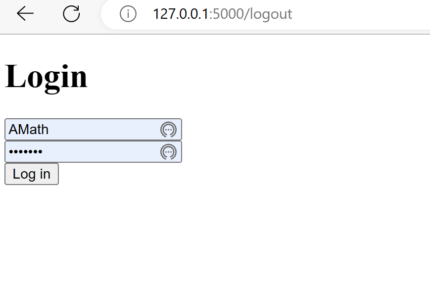
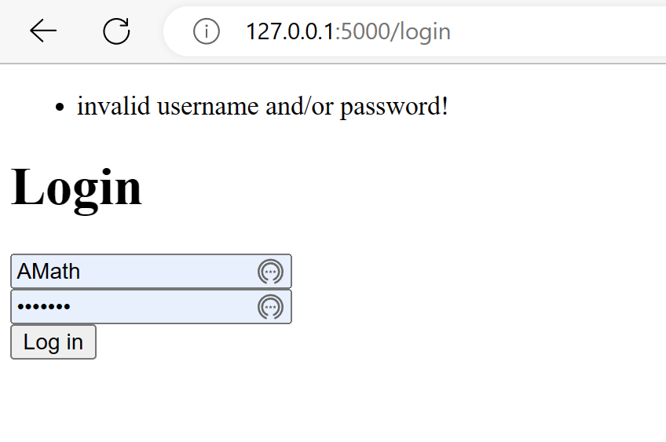
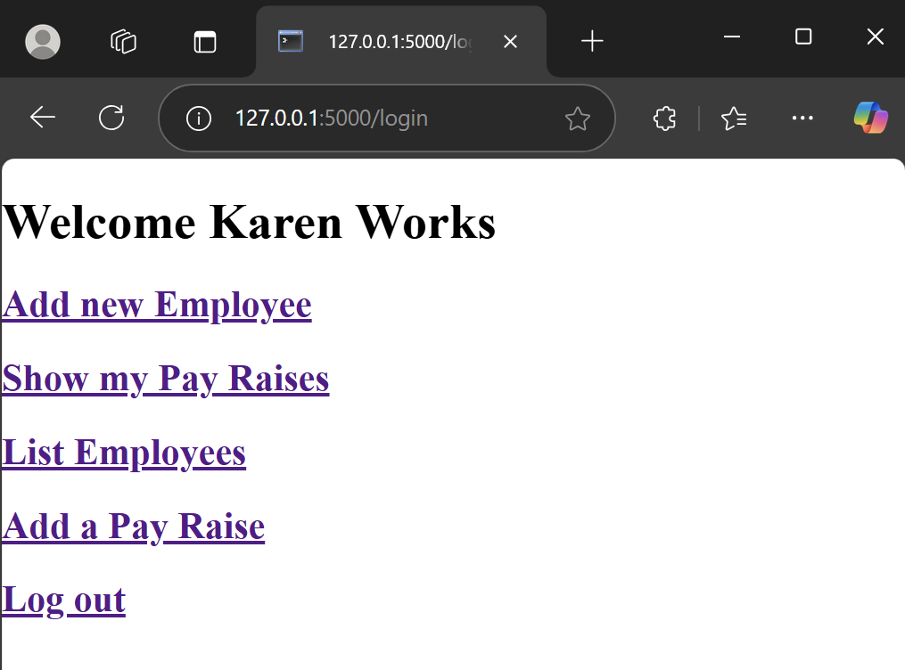
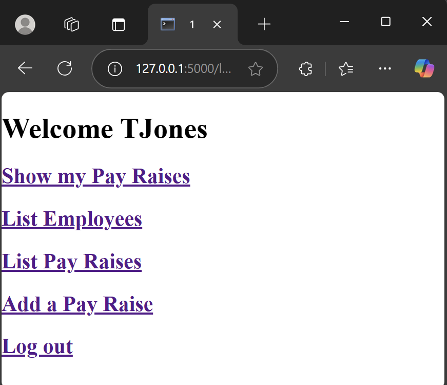
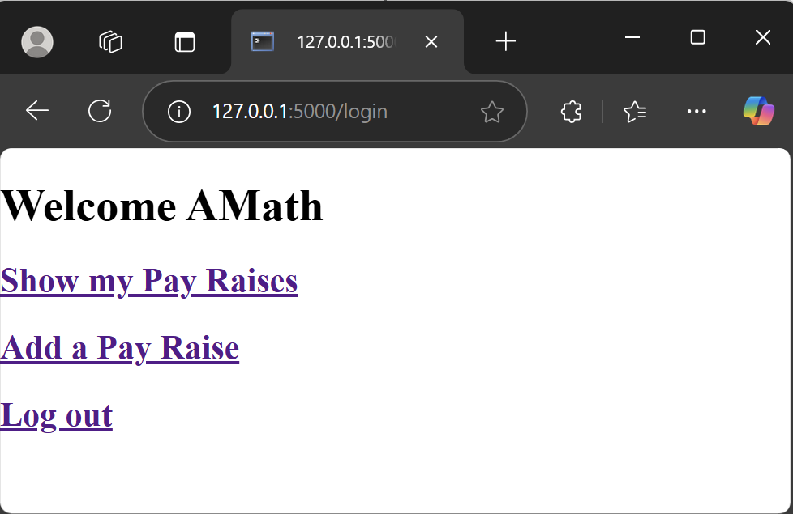
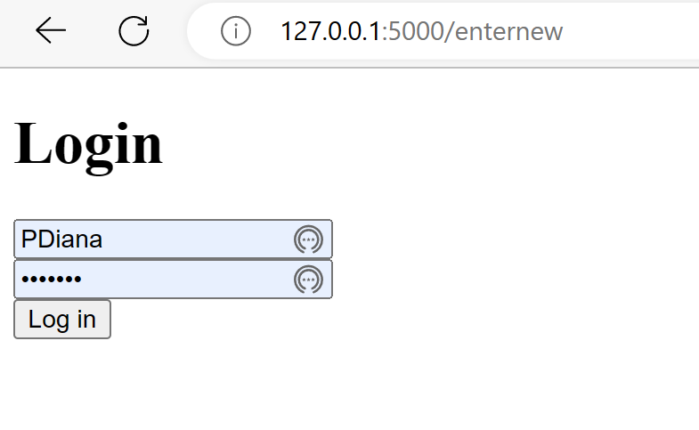
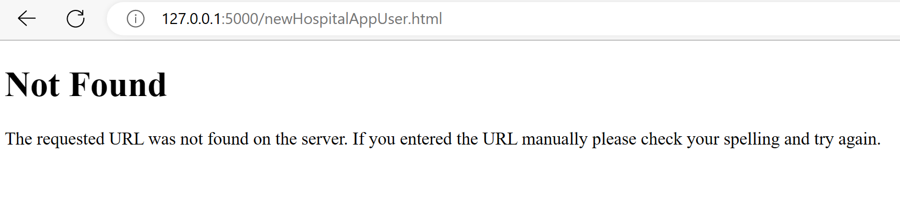
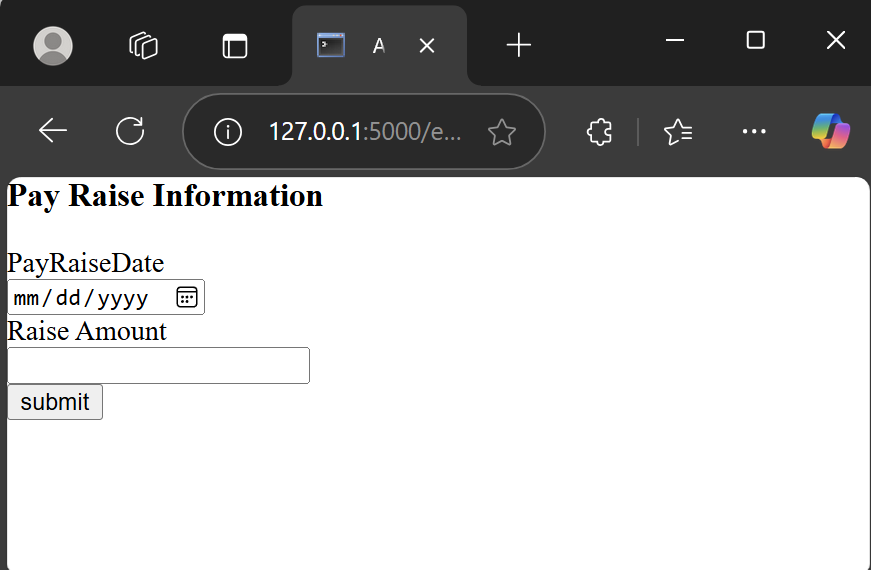

# Module 11: Build Role Based Access Control 

## Objectives Assessed:

* Develop code that encrypts data stored in a database for a small scale using third-party Python libraries discussed in the course.
* Solve a simple programming problem based on various approaches to computer security and information management.
* Build a small scale real-world application that incorporates the principles of secure computing including cryptography, network security, and data protection.

---

## Using Python and the `flask.session`, `flask.flash`, and `os` libraries ....

Starting from the website you created in [COP4521-Basic-Flask-Site](https://github.com/isaacjacques/COP4521-Basic-Flask-Site)

---

## The Log In page

**Should have two input boxes and one link**

* textboxes - username and password
* Button - Log In - (validates username and password. If valid opens - Home page, Otherwise notifies user "invalid username and/or password!" and stays on login page.)

**Here is an example of what this page should look like:**

**Here is an example of what this page should look like if an unsuccessful login occurs:**

---

## Make the following changes 

* Home
    * Add a logout link (logs the user out and places them on the login page)

    * Display user name at top
    
    * only displays options available to the user logged in

* New option - Show my pay raises - only available when a user is properly logged in

* Add new employee - only available when a user is properly logged in with SecurityLevel  = 1

* New option - Add a pay raise - only available when a user is properly logged in

* List employees - only available when a user is properly logged in with UserSecurityLevel  = 1 or 2

* List Pay Raises - only available when a user is properly logged in with SecurityLevel  = 2

All other logic must remain the same and work per the directions in [COP4521-Basic-Flask-Site](https://github.com/isaacjacques/COP4521-Basic-Flask-Site)

---

## The Home page

**add the following**

* textbox - (displays name of the Employee that is logged in)
* Link - Log out - (logs the user out and places them on the login page)

**Here is an example of what this page should look like for a user with SecurityLevel  =1:**

**Here is an example of what this page should look like for a user with SecurityLevel  =2:**

**Here is an example of what this page should look like for a user with SecurityLevel  =3:**

**If the user is NOT logged in and tries to access a page that should not be allowed per their SecurityLevel :**

redirected to the login screen

**If the user is logged in and tries to access a page that should not be allowed per their SecurityLevel :**

notifies user "Page not found"

**You must validate access in both in the python script and on the html pages**

---

## The Show my Pay Raises page

**Should have**

* a displays the following information for the current user from the  EmpPayRaise table:
  PayRaiseDate, and RaiseAmt

* Link - Go back to home page - (opens the Home page)

**Here is an example of what this page should look like:**

---

## The Add Pay Raise page

**Should have**

* a label and input text field for each possible attribute other than the ids
* Submit button -

**When the Submit button is clicked:**

* Validates the values entered by the user.
* If the values are valid then a record is added to the EmpPayRaise table with the values entered by the user and the user id of the user currently logged in then a record added message is sent to the result page to display to the user.
* Otherwise, an error message is created indicating all the input errors. This message is sent to the result page to display to the user.

These are similar to the results from The Add a new Employee page in Module 10 assignment. For brevity, I did not include images of these below.

### Input Validation Rules:

* the PayRaiseDate is not empty and does not only contain spaces and is a valid date (Hint: Top 4 Ways to Validate Date String Format in Python - sqlpey  [https://sqlpey.com/python/top-4-ways-to-validate-date-string-format-in-python/#google_vignette](https://sqlpey.com/python/top-4-ways-to-validate-date-string-format-in-python/#google_vignette))
* the RaiseAmt is a real number greater than 0 (Hint: Python - How to validate that a variable stores a numeric value [https://www.101computing.net/number-only/](https://www.101computing.net/number-only/) )

### Hints

* html date picker (see HTML input type="date" [https://www.w3schools.com/tags/att_input_type_date.asp](https://www.w3schools.com/tags/att_input_type_date.asp) )

**Here is an example of what this page should look like before any values are entered:**

---
